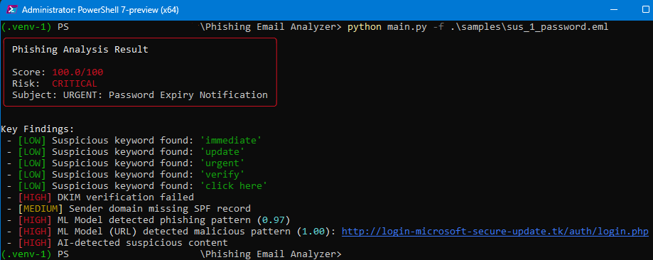
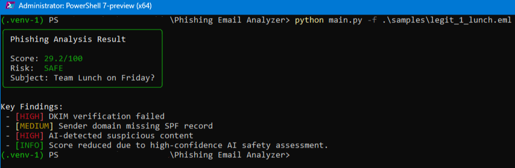
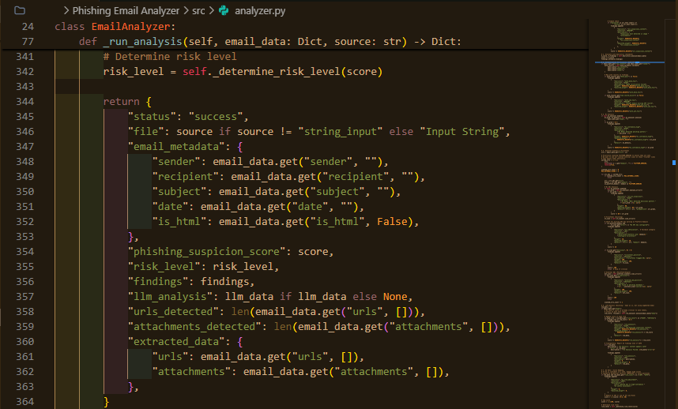

# Phishing Email Analyzer

A world-class, enterprise-grade phishing detection system designed to identify sophisticated email threats. This tool integrates active authentication verification, local machine learning, image-based OCR analysis, and external threat intelligence to provide a comprehensive security assessment of suspicious emails.


[](LICENSE)
[](https://github.com/Hao-Tec/phishing-email-analyzer)

## 🚀 Key Features

### 🧠 Hybrid AI & Zero-Day Detection

- **Dual-Engine Intelligence**: Combines the reasoning power of **Google Gemini Pro** (50% weight) with a local statistically-proven **Random Forest** model.
- **Zero-Day Protection**: The local model is auto-trained on 1,000+ advanced samples (CEO fraud, crypto scams) to detect novel threats even without internet access.
- **Visual OCR Analysis**: Uses **Tesseract OCR** to extract and analyze text embedded in images, defeating image-based spam filters.
- **Explainable AI**: Every detection comes with clear, human-readable reasoning (e.g., "Urgent language detected", "Sender domain mismatch").

### 🛡️ Smart Defense & False Positive Reduction

- **Trusted Ecosystems**: Intelligently recognizes relationships between domains (e.g., `microsoft.com` ↔ `aka.ms`) to prevent false alarms on legitimate redirects.
- **Dynamic Threat Intel**: Automatically checks generic links against **VirusTotal**, **PhishTank**, and **Google Safe Browsing**, while whitelisting known business tools (Zoom, Jira).
- **Active Auth Verification**: Validates DKIM/SPF/DMARC to verify sender identity beyond just header inspection.
- **Real-Time URL Analysis**: Fetches and analyzes the _actual content_ of suspicious links in real-time, allowing the AI to "see" fake login pages just like a user would.

### 🔍 Comprehensive Parsing

- **Advanced Format Support**: Native processing of `.eml`, `.msg` (Outlook), `.txt`, and `.eml.gz` archives.
- **Deep Content Extraction**: recursively parses multipart messages, extracts hidden headers, analyzes HTML/Text payloads, and isolates attachments.

## 📸 Screenshots

|                Critical Alert                 |                       Safety Veto                        |
| :-------------------------------------------: | :------------------------------------------------------: |
|  |                   |
|  _System detects complex phishing attempts_   | _AI overrides mechanical failures for legitimate emails_ |


_Professional, clean code architecture_

## 📦 Installation

### Prerequisites

- Python 3.8+
- [Tesseract OCR](https://github.com/tesseract-ocr/tesseract) (Required for image analysis)
  - Windows: [Installer](https://github.com/UB-Mannheim/tesseract/wiki)
  - Linux: `sudo apt install tesseract-ocr`
  - macOS: `brew install tesseract`

### Setup

1. **Clone the repository**

   ```bash
   git clone https://github.com/Hao-Tec/phishing-email-analyzer.git
   cd phishing-email-analyzer
   ```

2. **Install core dependencies**

   ```bash
   pip install -r requirements.txt
   ```

3. **Configure Environment**
   Create a `.env` file in the root directory with your API keys:

   ```ini
   # Essential for AI Analysis
   GEMINI_API_KEY=your_gemini_key

   # Essential for External Threat Checks
   VIRUSTOTAL_API_KEY=your_vt_key
   SAFE_BROWSING_API_KEY=your_google_safe_browsing_key
   PHISHTANK_API_KEY=your_phishtank_key (Optional)
   ```

4. **Configure Local LLM (Optional)**
   To use a local LLM (like Ollama) instead of Gemini:
   - Ensure your local server is running (e.g., `ollama serve`).
   - Open `src/config.py` and set:
     ```python
     LLM_PROVIDER = "local"
     LLM_LOCAL_URL = "http://localhost:11434/v1/chat/completions" # Adjust if needed
     ```

## 💻 Usage

### Command Line Interface

**Analyze a single email:**

```bash
python main.py -f suspicious_email.msg
```

**Generate a detailed HTML report:**

```bash
python main.py -f invoice.eml --format html -o analysis_report.html
```

**Bulk scan a directory:**

```bash
python main.py -d ./investigations/ --format json -o batch_results.json
```

### Python API

Integrate the analyzer into your own security pipelines:

```python
from src.analyzer import EmailAnalyzer

# Initialize with all advanced engines (ML, OCR, Auth, etc.)
analyzer = EmailAnalyzer()

# Run deep analysis
result = analyzer.analyze_email("path/to/suspected_phish.msg")

if result['risk_level'] == 'CRITICAL':
    print(f"🚨 Blocked: {result['phishing_suspicion_score']}/100")
    print(f"Findings: {result['findings']}")
else:
    print("✅ Email appears safe")
```

## 📊 Detection Logic

The system employs a multi-layered approach to calculate risk:

1.  **Transport Layer**: Checks SPF, DKIM, and DMARC alignment.
2.  **Static Heuristics**: 8+ rule-based checks for obfuscation, typosquatting, and anomalies.
3.  **Threat Intel**: Queries external databases for known malicious indicators.
4.  **Content Analysis**:
    - **ML**: Statistical probability based on feature vectors.
    - **OCR**: Text extraction from images.
    - **LLM**: Contextual understanding of intent and urgency.

## 🛠️ Architecture

The tool is built on a modular architecture to allow easy extension. See [ARCHITECTURE.md](ARCHITECTURE.md) for a detailed deep-dive.

- `src/auth_validator.py`: Handles active DNS and crypto verification.
- `src/ml_analyzer.py`: Manages local scikit-learn models.
- `src/image_analyzer.py`: Interface for Tesseract OCR.
- `src/external_scanners.py`: API wrappers for Safe Browsing/PhishTank.
- `src/vt_scanner.py`: Integration with VirusTotal API.
- `src/url_scraper.py`: Safe, real-time fetching of URL content for analysis.
- `src/llm_analyzer.py`: Advanced semantic analysis using Large Language Models.
- `src/analyzer.py`: The central orchestrator fusing all signals.

## 🤝 Contributing

Contributions are welcome! Please see [CONTRIBUTING.md](CONTRIBUTING.md) for guidelines.

## 📄 License

MIT License - see [LICENSE](LICENSE) for details.

---

_Built for security researchers and SOC analysts._
